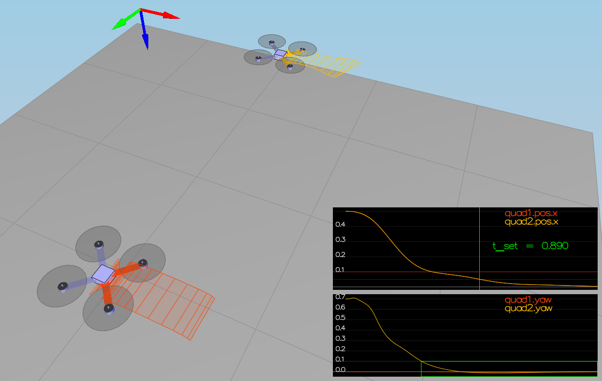

# Writeup for Building a Controller in C++
This writeup shortly summarizes the solution to the project task, briefly addressing each criteria of the project rubric.

#  Implemented Controller
As the implementation stays within the given framework code and implements the control algorithms from the lectures in a straight forward way,
I decided to put most of the documentation inside the code, and keep the additional information in this writeup lean.

## Implemented body rate control in C++.

Rubric criteria: The controller should be a proportional controller on body rates to commanded moments. The controller should take into account the moments of inertia of the drone when calculating the commanded moments.

The implemented code fragment is:
```
////////////////////////////// BEGIN STUDENT CODE ///////////////////////////
  // put parameters for moments of inertia into a vector
  V3F momentOfInertia(Ixx, Iyy, Izz);
  
  // calculate error between commanded/desired moment and actual one
  V3F bodyRateError = pqrCmd - pqr;
  
  // calculate vector of desired moments based on error and on inertia and gain parameters
  momentCmd = momentOfInertia * kpPQR * bodyRateError;
/////////////////////////////// END STUDENT CODE ////////////////////////////
```
## Implement roll pitch control in C++.

Rubric criteria: The controller should use the acceleration and thrust commands, in addition to the vehicle attitude to output a body rate command. The controller should account for the non-linear transformation from local accelerations to body rates. Note that the drone's mass should be accounted for when calculating the target angles.

The implemented code fragment is:
```
////////////////////////////// BEGIN STUDENT CODE ///////////////////////////
  // convert thrust force into acceleration (taking the mass into account)
  float accel = - collThrustCmd / mass;
  
  if ( collThrustCmd > 0 ) {
      // only required if total thrust is positive
      
      // limit roll command according to maxTiltAngle
      float body_roll_x_cmd = CONSTRAIN(accelCmd.x / accel, -maxTiltAngle, maxTiltAngle);
      
      // calculate error on x axis based on the given rotation matrix
      float body_roll_x_err = body_roll_x_cmd - R(0,2);
      // apply gain parameter kpBank
      float body_roll_x_p_term = kpBank * body_roll_x_err;
      
      // limit pitch command according to maxTiltAngle
      float body_pitch_y_cmd = CONSTRAIN(accelCmd.y / accel, -maxTiltAngle, maxTiltAngle);
      // calculate error on y axis based on the given rotation matrix
      float body_pitch_y_err = body_pitch_y_cmd - R(1,2);
      // apply gain parameter kpBank
      float body_pitch_y_p_term = kpBank * body_pitch_y_err;
      
      // derive rotational forces for x/y component of the pqr command
      pqrCmd.x = (R(1,0) * body_roll_x_p_term - R(0,0) * body_pitch_y_p_term) / R(2,2);
      pqrCmd.y = (R(1,1) * body_roll_x_p_term - R(0,1) * body_pitch_y_p_term) / R(2,2);
  } else {
      pqrCmd.x = 0.0;
      pqrCmd.y = 0.0;
  }
  
  // z component of pqr command is 0, as we only control roll and pitch here
  pqrCmd.z = 0;

/////////////////////////////// END STUDENT CODE ////////////////////////////
```

## Implement altitude controller in C++.

Rubric criteria: The controller should use both the down position and the down velocity to command thrust. Ensure that the output value is indeed thrust (the drone's mass needs to be accounted for) and that the thrust includes the non-linear effects from non-zero roll/pitch angles.

Additionally, the C++ altitude controller should contain an integrator to handle the weight non-idealities presented in scenario 4.

The implemented code fragment is:
```
////////////////////////////// BEGIN STUDENT CODE ///////////////////////////
  // calculate altitude error/error on z-axis
  float z_err = posZCmd - posZ;
  // calculate error in velocity in z direction
  float z_dot_err = velZCmd - velZ;
  // integrate the error over one time step
  integratedAltitudeError += z_err * dt;
  
  // calculate the components for a PID controller for altitude, using the corresponding parameters
  float p_term = kpPosZ * z_err;
  float d_term = kpVelZ * z_dot_err + velZ;
  float i_term = KiPosZ * integratedAltitudeError;
  float b_z = R(2,2);

  // determine u1 bar and acceleration
  float u_1_bar = p_term + d_term + i_term + accelZCmd;
  float accel = ( u_1_bar - CONST_GRAVITY ) / b_z;

  // derive collective thrust in [N], taking mass into accound and limiting to the range of [-maxDescentrate, maxAscentRate]
  thrust = -mass * CONSTRAIN(accel, -maxDescentRate / dt, maxAscentRate / dt);

/////////////////////////////// END STUDENT CODE ////////////////////////////
```

## Implement lateral position control in C++.

Rubric criteria: The controller should use the local NE position and velocity to generate a commanded local acceleration.

The implemented code fragment is:
```
////////////////////////////// BEGIN STUDENT CODE ///////////////////////////
  // for easier handling: represent position and velocity parameters as vectors
  V3F kpPos(kpPosXY, kpPosXY, 0.f);
  V3F kpVel(kpVelXY, kpVelXY, 0.f);
  
  // limit velocity command to take limits of drone into account
  if ( velCmd.mag() > maxSpeedXY ) {
      velCmd = velCmd.norm() * maxSpeedXY;
  }
  
  // calculate position and velocity errors
  V3F posErr = posCmd - pos;
  V3F velErr = velCmd - vel;
  // derive which value to add to the feed-forward value
  // via proportionally taking both errors into account
  accelCmd += kpPos * posErr + kpVel * velErr;
  
  // limit resulting acceleration command to take physical imits of drone into account
  if ( accelCmd.mag() > maxAccelXY ) {
      accelCmd = accelCmd.norm() * maxAccelXY;
  }
/////////////////////////////// END STUDENT CODE ////////////////////////////
```

## Implement yaw control in C++.

Rubric criteria: The controller can be a linear/proportional heading controller to yaw rate commands (non-linear transformation not required).

The implemented code fragment is:
```
////////////////////////////// BEGIN STUDENT CODE ///////////////////////////
  // unwrap commanded yaw either to [-2Pi, 0] or [0, 2Pi]
  if (yawCmd > 0) {
      yawCmd = fmodf(yawCmd, 2.f * F_PI);
  } else {
      yawCmd = fmodf(yawCmd, -2.f * F_PI);
  }

  // normalize into range [-Pi, Pi]
  if (yawCmd <= -F_PI) {
      yawCmd += (2.0f * F_PI);
  } else {
      if (yawCmd > F_PI) {
          yawCmd -= (2.0f * F_PI);
      }
  }

  // calculate yaw error
  float yawErr = yawCmd - yaw;
  // calculate yaw rate proportionally on error, using kpYaw parameter
  yawRateCmd = kpYaw * yawErr;
/////////////////////////////// END STUDENT CODE ////////////////////////////
```

## Implement calculating the motor commands given commanded thrust and moments in C++.

Rubric criteria: The thrust and moments should be converted to the appropriate 4 different desired thrust forces for the moments. Ensure that the dimensions of the drone are properly accounted for when calculating thrust from moments.

The implemented code fragment is:
```
////////////////////////////// BEGIN STUDENT CODE ///////////////////////////
  // take length parameter (distance of rotors) into account
  float len = L / sqrtf(2.f);
  
  // total thrust
  float F_total = collThrustCmd;
  // calculate the three thrust components for x/y/z axis
  float F_roll_x = momentCmd.x / len; // moment on x axis/roll
  float F_pitch_y = momentCmd.y / len; // moment on y axis/pitch
  float F_yaw_z = - momentCmd.z / kappa; // moment on z axis/yaw

  // derive desired thrust for each rotor
  cmd.desiredThrustsN[0] = (F_total + F_roll_x + F_pitch_y + F_yaw_z)/4.f;  // front left / f1
  cmd.desiredThrustsN[1] = (F_total - F_roll_x + F_pitch_y - F_yaw_z)/4.f;  // front right / f2
  cmd.desiredThrustsN[2] = (F_total + F_roll_x - F_pitch_y - F_yaw_z)/4.f;  // rear left / f4
  cmd.desiredThrustsN[3] = (F_total - F_roll_x - F_pitch_y + F_yaw_z)/4.f;  // rear right / f3
/////////////////////////////// END STUDENT CODE ////////////////////////////
```

# Flight Evaluation

## Your C++ controller is successfully able to fly the provided test trajectory and visually passes inspection of the scenarios leading up to the test trajectory.

Rubric criteria: Ensure that in each scenario the drone looks stable and performs the required task. Specifically check that the student's controller is able to handle the non-linearities of scenario 4 (all three drones in the scenario should be able to perform the required task with the same control gains used).

After iterative parameter tuning guided by the tips of the project readme, the overall controller was stable enough to pass all five scenarios, both judged visually as well as by the corresponding PASS criteria on the command line.

### Position/velocity and yaw angle control (scenario 3)

Yaw angle of the second drone is correctly controlled, and with the parameter set, no significant overshoot can be observed in this scenario:


### Non-idealities and robustness (scenario 4)

Although the red vehicle takes a bit longer to adjust to the heavier weight, it reaches the commanded position in a stable trajectory (I guess this could be optimized by further tuning of the parameters):


### Tracking trajectories (scenario 5)

In scenario 5, while the orange vehicle is able to follow the trajectory quite well, the positional error of the red vehicle is significantly bigger:


## Final parameter set
This is the final set of parameters that was reached after iterative tuning.
If further optimization would be important, I would try to automate the scenarios and collecting the metrics results to facilitate further iterative refinements.

```
############################## SLR SIMPLECONFIG ############################
# this is a comment. [X] is a namespace. [X:Y] initializes X from Y
# Namespace and parameter names are not case-sensitive
# X=Y sets X to Y. Y may be a string, float, or list of 3 floats
############################################################################

[QuadControlParams] 

UseIdealEstimator=1

# Physical properties
Mass = 0.5
L = 0.17
Ixx = 0.0023
Iyy = 0.0023
Izz = 0.0046
kappa = 0.016
minMotorThrust = .1
maxMotorThrust = 4.5

# Position control gains
kpPosXY = 30
kpPosZ = 22
KiPosZ = 40

# Velocity control gains
kpVelXY = 12
kpVelZ = 10

# Angle control gains
kpBank = 10
kpYaw = 3

# Angle rate gains
kpPQR = 90, 90, 8

# limits
maxAscentRate = 5
maxDescentRate = 2
maxSpeedXY = 5
maxHorizAccel = 12
maxTiltAngle = .7
```

## Optional challenges
None of the optional challenges was addressed - sorry!

